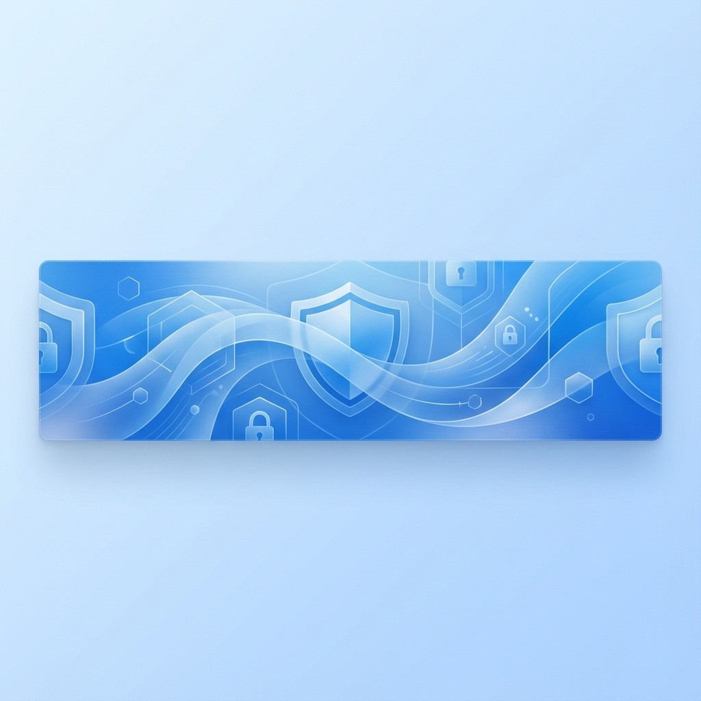

<div align="center">
    <a href="https://github.com/Zendevve/cc-version-guard">
        
    </a>
</div>

<br>

<div align="center">
    <a href="https://prgportfolio.com" target="_blank">
        
    </a>
    <br>
    <a href="LICENSE">
        
    </a>
    <a href="https://tauri.app">
        
    </a>
    <a href="https://www.rust-lang.org">
        
    </a>
    <a href="https://developer.mozilla.org/en-US/docs/Web/JavaScript">
        
    </a>
</div>

<br>

<div align="center">
  <b>CC Version Guard</b> is a powerful, secure version manager for CapCut desktop, giving creators full control over their editing workspace.
</div>

> [!CAUTION]
> **IMPORTANT LEGAL NOTICE** - Please read before using this software:
>
> 1. **UNOFFICIAL THIRD-PARTY TOOL:** This software is **NOT** affiliated with, endorsed by, or connected to ByteDance Ltd. or CapCut.
> 2. **NO CAPCUT DISTRIBUTION:** We do **NOT** host, distribute, crack, or modify CapCut binaries. All version links point **directly** to official ByteDance/CapCut servers.
> 3. **TERMS OF SERVICE RISK:** Using version management tools **MAY VIOLATE** CapCut's Terms of Service. You use this software **entirely at your own risk**.
> 4. **NO WARRANTY:** This software is provided "AS IS" with NO WARRANTY of any kind. See [LEGAL_DISCLAIMER.md](LEGAL_DISCLAIMER.md) for full terms.
>
> **BY USING THIS SOFTWARE, YOU ACCEPT ALL RISKS** and agree to indemnify the author from any claims, damages, or legal action.

> [!NOTE]
> **Trademark Notice:** "CapCut" is a registered trademark of ByteDance Ltd. We claim NO ownership of this trademark. Our use is purely nominative  (identifying the software this tool manages) under fair use principles.

> [!NOTE]
> **Download Sources:** All "Legacy Versions" are sourced **directly and exclusively** from official CapCut servers (`lf16-capcut.faceulv.com`). We merely provide **links**, not files.

> [!CAUTION]
> **BINARY DISTRIBUTION RESTRICTED:**
>
> - **Pre-compiled binaries** (.exe, .msi) may ONLY be distributed by **Zendevve** (the author)
> - **Redistribution of binaries** is PROHIBITED (as specified in LICENSE)
> - You may **compile from source** for personal use under license terms
> - See [COMMERCIAL_LICENSE.md](COMMERCIAL_LICENSE.md) for commercial use details

---------------

## Legal Documentation

Before using this software, please review:

- **[LEGAL_DISCLAIMER.md](LEGAL_DISCLAIMER.md)** - Comprehensive legal protections and risk disclosures
- **[COMMERCIAL_LICENSE.md](COMMERCIAL_LICENSE.md)** - Commercial distribution details and binary licensing
- **[LICENSE](LICENSE)** - Full license terms

**CRITICAL:** This software may result in CapCut account suspension or legal action from ByteDance. Proceed at your own risk.

---------------

## Table of Contents

- [Features](#features)
- [Background Story](#background-story)
- [Getting Started](#getting-started)
  - [Prerequisites](#prerequisites)
  - [Installation](#installation)
- [What's Inside?](#whats-inside)
- [What's Next?](#whats-next)
- [Project](#project)
- [Contributing](#contributing)
- [License](#license)
- [Footer](#footer)

## Features

- 🔒 **Version Lock:** Securely lock your preferred version to prevent unexpected changes, keeping your workflow stable.
- 💾 **Version Switching:** Instantly switch between multiple installed versions without re-downloading.
- ⬇️ **Legacy Downloader:** Access and install previous official versions of CapCut directly from their servers.
- 📦 **Backup Manager:** Create and restore backups of your specific version installations.
- 🚀 **Performance Optimized:** Built with Rust and Tauri for a lightweight, blazing-fast experience.
- 🎨 **Tahoe Design:** A beautiful, modern interface following Apple's macOS Tahoe design system.

## Background Story

As a video editor, I was frustrated by mandatory updates that would often break my workflow or change features I relied on. I needed a way to stick to a stable version of CapCut while still having the flexibility to test new features when I chose to—not when the software decided.

I built **CC Version Guard** to give power back to the creators. It started as a simple script and evolved into a full-fledged application, prioritizing security, legality, and user experience.

## Getting Started

### Prerequisites

- Windows 10 or 11
- [WebView2 Runtime](https://developer.microsoft.com/en-us/microsoft-edge/webview2/) (usually installed by default)

### Installation

This project is proprietary. You can compile it yourself for personal use by following the comprehensive guide below.

> [!TIP]
> **Pre-built installers coming soon!** Follow the project for updates on ready-to-use releases.

#### 2.1 Development Environment Prerequisites

Before attempting to build from source, ensure your development environment meets the following specifications:

| Component | Minimum Version | Recommended | Notes |
|-----------|-----------------|-------------|-------|
| Windows SDK | 10.0.19041.0 | Latest | Required for MSVC linker |
| Visual Studio Build Tools | 2019 | 2022 | C++ workload required |
| Rust Toolchain | 1.70.0 | stable-x86_64-pc-windows-msvc | Nightly may work but is unsupported |
| Node.js | 18.x LTS | 20.x LTS | npm 9.x+ bundled |
| WebView2 SDK | 1.0.1264.42 | Latest | Auto-installed via Tauri |
| Git | 2.40+ | Latest | For submodule initialization |

#### 2.2 Rust Toolchain Configuration

1. Download and execute the `rustup-init.exe` installer from [rustup.rs](https://rustup.rs/)
2. When prompted, select "Customize installation" and configure:
   ```
   Default host triple: x86_64-pc-windows-msvc
   Default toolchain: stable
   Profile: complete
   Modify PATH variable: yes
   ```
3. Post-installation, verify your toolchain configuration:
   ```bash
   rustup show
   rustc --version --verbose
   cargo --version
   ```
4. Ensure the MSVC linker is discoverable:
   ```bash
   where link.exe
   # Expected: C:\Program Files\Microsoft Visual Studio\2022\BuildTools\VC\Tools\MSVC\14.xx.xxxxx\bin\Hostx64\x64\link.exe
   ```

#### 2.3 Visual Studio Build Tools Installation

The Rust MSVC toolchain requires the Visual C++ build environment. Install via Visual Studio Installer:

1. Download [Visual Studio Build Tools 2022](https://visualstudio.microsoft.com/downloads/#build-tools-for-visual-studio-2022)
2. In the installer, select the following workloads and components:
   - **Desktop development with C++**
     - MSVC v143 - VS 2022 C++ x64/x86 build tools (Latest)
     - Windows 11 SDK (10.0.22621.0) or Windows 10 SDK
     - C++ CMake tools for Windows
     - C++ ATL for latest v143 build tools (x86 & x64)
3. Set environment variables if not auto-configured:
   ```powershell
   $env:PATH += ";C:\Program Files\Microsoft Visual Studio\2022\BuildTools\VC\Tools\MSVC\14.38.33130\bin\Hostx64\x64"
   $env:LIB = "C:\Program Files\Microsoft Visual Studio\2022\BuildTools\VC\Tools\MSVC\14.38.33130\lib\x64"
   $env:INCLUDE = "C:\Program Files\Microsoft Visual Studio\2022\BuildTools\VC\Tools\MSVC\14.38.33130\include"
   ```

#### 2.4 Node.js and Package Manager Setup

1. Install Node.js LTS from [nodejs.org](https://nodejs.org/) or via `winget`:
   ```powershell
   winget install OpenJS.NodeJS.LTS
   ```
2. Verify installation and npm version:
   ```bash
   node --version   # Should output v18.x.x or v20.x.x
   npm --version    # Should output 9.x.x or 10.x.x
   ```
3. Configure npm registry (optional, for corporate networks):
   ```bash
   npm config set registry https://registry.npmjs.org/
   npm config set strict-ssl true
   ```

#### 2.5 Tauri CLI Installation

Install the Tauri command-line interface globally:

```bash
cargo install tauri-cli --version "^2.0.0" --locked
```

Verify installation:
```bash
cargo tauri --version
# Expected: tauri-cli 2.x.x
```

> **Note:** If you encounter SSL certificate errors during cargo install, you may need to configure your system's certificate store or set `CARGO_HTTP_CHECK_REVOKE=false` (not recommended for production).

#### 2.6 Repository Cloning and Dependency Resolution

1. Clone the repository with submodules:
   ```bash
   git clone --recurse-submodules https://github.com/Zendevve/capcut-version-guard.git
   cd capcut-version-guard
   ```
2. If you forgot `--recurse-submodules`, initialize them manually:
   ```bash
   git submodule update --init --recursive
   ```
3. Install Node dependencies:
   ```bash
   npm ci
   ```
   > Use `npm ci` instead of `npm install` for reproducible builds from `package-lock.json`.

4. Verify Tauri dependencies are satisfied:
   ```bash
   cargo tauri info
   ```
   This will output a diagnostic report. Ensure no errors appear in the "Environment" section.

#### 2.7 Building the Application

**Development Build (with hot-reload):**
```bash
npm run tauri dev
```

**Production Build:**
```bash
npm run tauri build
```

The compiled installer will be located at:
```
src-tauri/target/release/bundle/
├── msi/
│   └── CC Version Guard_x.x.x_x64_en-US.msi
└── nsis/
    └── CC Version Guard_x.x.x_x64-setup.exe
```

#### 2.8 Troubleshooting Common Build Failures

| Error | Cause | Resolution |
|-------|-------|------------|
| `linker 'link.exe' not found` | Missing MSVC Build Tools | Install Visual Studio Build Tools with C++ workload |
| `error[E0463]: can't find crate` | Corrupted cargo cache | Run `cargo clean && cargo update` |
| `ENOENT: npm` | Node.js not in PATH | Reinstall Node.js or add to PATH manually |
| `WebView2 not found` | Missing runtime | Install [WebView2 Runtime](https://developer.microsoft.com/en-us/microsoft-edge/webview2/) |
| `STATUS_ENTRYPOINT_NOT_FOUND` | DLL version mismatch | Rebuild with clean target: `cargo clean` |
| `error: failed to compile` | Insufficient disk space | Ensure 10GB+ free on build drive |

#### 2.9 Build Configuration (Advanced)

For custom builds, modify `src-tauri/tauri.conf.json`:

```jsonc
{
  "build": {
    "beforeBuildCommand": "npm run build",
    "beforeDevCommand": "npm run dev",
    "frontendDist": "../dist"
  },
  "bundle": {
    "targets": ["msi", "nsis"],  // Remove unwanted bundle types
    "windows": {
      "wix": {
        "language": ["en-US"]
      }
    }
  }
}
```

For release builds with custom signing, set environment variables:
```powershell
$env:TAURI_SIGNING_PRIVATE_KEY = "path/to/private.key"
$env:TAURI_SIGNING_PRIVATE_KEY_PASSWORD = "your-secure-password"
```

## What's Inside?

```bash
├── .github/              # Community health files (PRG Gold Standard)
│   ├── CODE_OF_CONDUCT.md
│   ├── CONTRIBUTING.md
│   ├── CREDITS.md
│   └── SECURITY.md
├── src-tauri/            # Rust Backend
│   ├── src/
│   │   ├── commands/     # App logic (autostart, backup, protection)
│   │   └── main.rs       # Entry point
│   ├── icons/            # App icons
│   └── tauri.conf.json   # Configuration
├── src/                  # Frontend
│   ├── assets/           # UI Assets
│   ├── index.html        # Main View
│   ├── input.css         # Tailwind & Custom Styles
│   └── main.js           # UI Logic
└── README.md             # This file
```

## What's Next?

We have exciting plans to expand CC Version Guard:

- **MacOS Support:** Investigating feasibility for Mac users.
- **Cloud Sync:** Sync your version preferences across devices.
- **Enhanced Switcher:** Faster switching mechanism with atomic operations.
- **Localization:** Support for multiple languages.

## Project

View our roadmap and track progress on our [GitHub Projects Board](https://github.com/users/Zendevve/projects/1).

## Contributing

We welcome contributions! Please see [CONTRIBUTING.md](.github/CONTRIBUTING.md) for details on how to submit pull requests, report issues, and improve the project.

## License

Distributed under the **CC Version Guard License**. See `LICENSE` for more information.

This is a **Proprietary** project with restricted binary distribution:
- The **Source Code** is proprietary for personal use.
- **Zendevve** retains the **exclusive right** to distribute official binaries.
- Redistribution of pre-built binaries is **strictly prohibited**.

## Footer

### Credits

- **Author:** [Zendevve](https://github.com/Zendevve)
- **Design:** Based on macOS Tahoe System

---------------

<div align="center">
    <a href="https://github.com/Zendevve/capcut-version-guard">
        
    </a>
</div>
